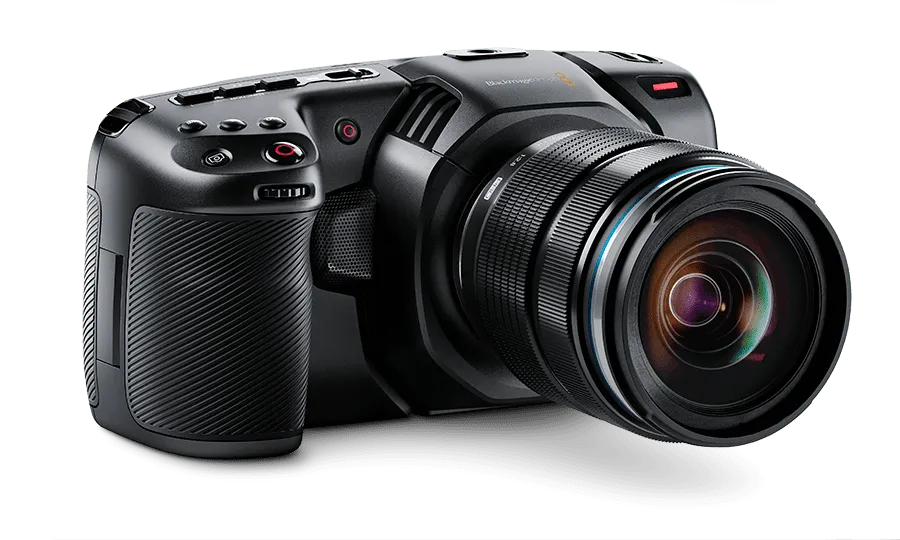
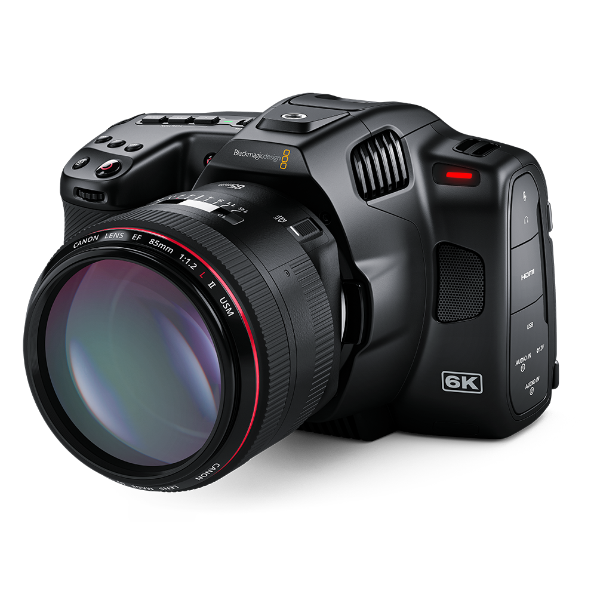
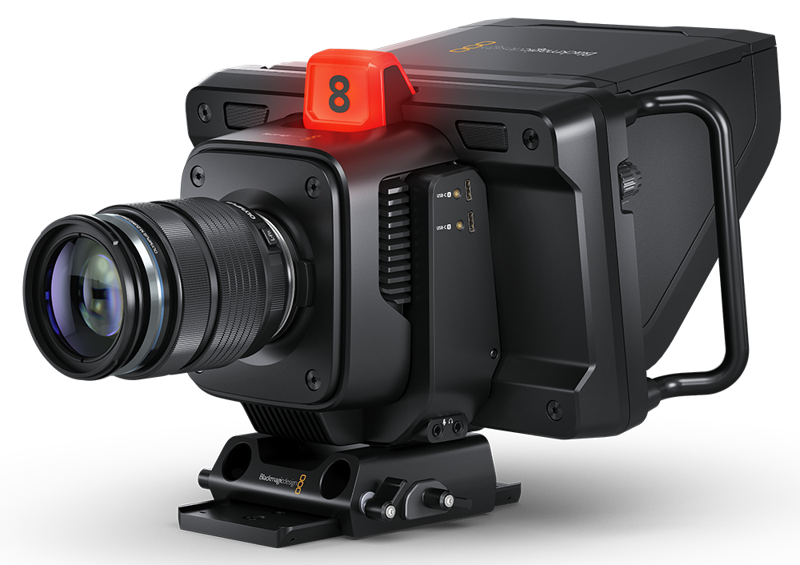
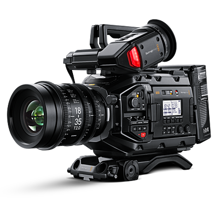
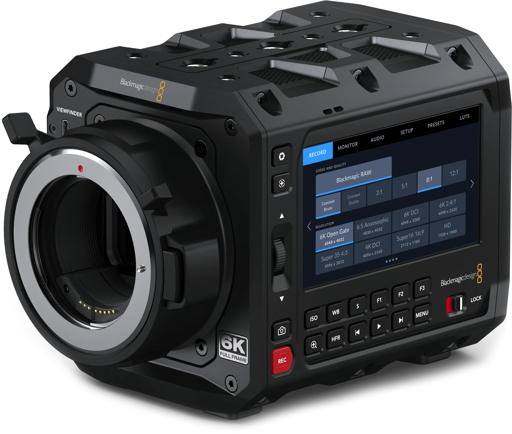

# Introduction

    
    
    
    
    

_Welcome!_ I'm glad you could join me in this tutorial series. I noticed a lack of beginner-friendly tutorials for [Blackmagic Design's](https://blackmagicdesign.com) REST API for controlling cameras, HyperDecks, and other BMD products. Since I had to learn it for controlling my own equipment, I'm making these tutorials to help anyone who might be struggling themselves.

These tutorials will serve as a public resource for learning how these APIs work and how to incorporate them into your own workflow/projects. We'll start from the basics and build our way up to a fully custom, functional [Web UI](https://github.com/DylanSpeiser/BM-Camera-Control-WebUI) that can control a camera or a HyperDeck over the network.

## Official Documentation

Blackmagic hosts the official documentation for the REST API [here](https://documents.blackmagicdesign.com/DeveloperManuals/RESTAPIforBlackmagicCameras.pdf?_v=1696143610000). The first few pages are important, so make sure to read them! This documentation outlines all of the commands and data that can interface with the camera, and is the basis of this tutorial series.

<a href="https://documents.blackmagicdesign.com/DeveloperManuals/RESTAPIforBlackmagicCameras.pdf?_v=1696143610000">Click me to go to the official documentation!</a>

## Requirements

The purpose of implementing the features of these APIs is to control them remotely without needing _any_ extra hardware. We'll implement everything ourselves, in a free and accessible programming language like Python or JavaScript.

Other than a way to write and run scripts in your language of choice, you'll need:

- A Blackmagic device to control (camera, HyperDeck, etc.)
- A network (preferably a private wired one)
- A USB cable (for initial configuration of the device)

---

## Table of Contents

1.  [REST API Calls](#)
2.  [JSON Data](#)
3.  [Working with Data](#)
4.  [Conducting an Orchestra](#)
5.  [WebSocket Updates](#)
6.  [Web UI](#)

---

## About the Author

Dylan Speiser is a Computer Engineer and Cinematographer from New York, NY. Studying at the University of Maryland, Dylan's passion for the technology of storytelling is a main focus of his studies and extracurriculars. He is Vice President of the Maryland Filmmakers club and acts in the Maryland Shakespeare Players' semesterly productions. To learn more about Dylan and his portfolio, check out <a href="https://speiserproductions.com">speiserproductions.com</a>.

 

---